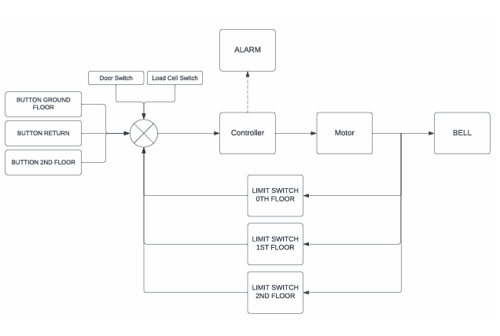
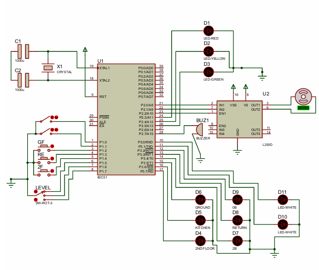
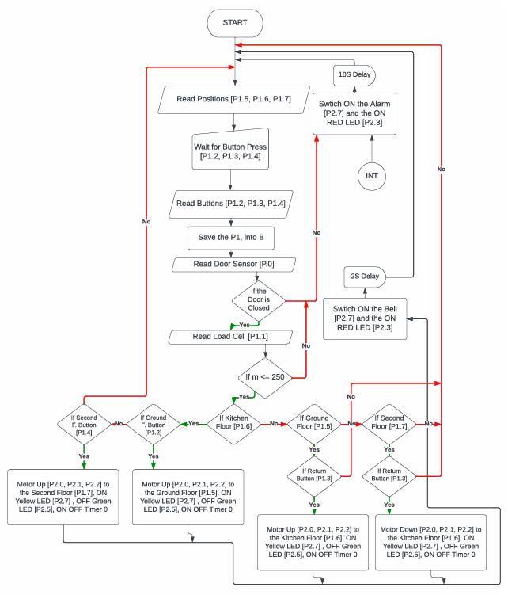
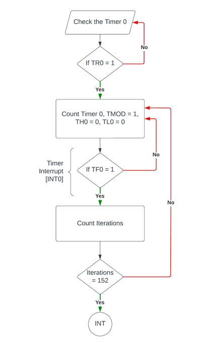
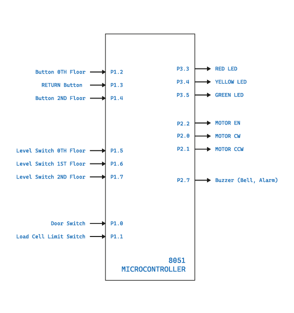
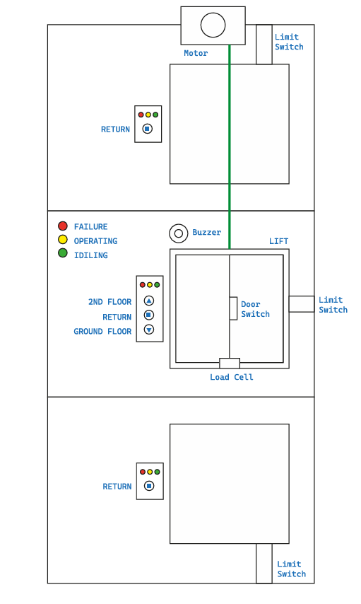

# 8051-Based Dumbwaiter Lift Controller

This is a university design project for "EEX4436: Microprocessors and Interfacing." It is a complete simulation of a 3-floor electronic dumbwaiter (food lift) controlled by an 8051 microcontroller using Assembly language.

The entire system, including the 8051, sensors, and motor driver, was simulated using Proteus.

**Note:** The original university report is not included in this repository for privacy. All necessary code and simulation files are provided.

## Key Features

* **3-Floor Operation:** The lift can be called to and sent from the Ground Floor, Kitchen (1st), and 2nd Floor.
* **Motor Control:** Uses an L293D motor driver to control the lift's DC motor (CW for up, CCW for down) with 50% PWM.
* **Safety Checks:**
    * **Weight Limit:** A load cell sensor (simulated as a switch) checks if the weight is $\le$ 250kg. If overweight, an alarm sounds.
    * **Door Sensor:** The lift will not move if the door is open.
* **Status Indicators (LEDs):**
    * **Green:** Idle (waiting for input)
    * **Yellow:** Operating (moving)
    * **Red:** Failure/Error (e.g., overweight, door open, timeout)
* **Error Alarms:**
    * A 10-second timer interrupt (Timer 0) checks if the lift is "stuck." If it times out, the alarm sounds.
    * The alarm also sounds for overweight loads or if the door is open when a command is given.

## System Diagrams

The system diagrams from the original report are included below for reference.

### Block Diagram

### Circuit Schematic (Proteus)

### Main Logic Flowchart

### Timer Interrupt Flowchart

### MCU Pinout

### Physical Layout

## File Guide

* **`Dumbwaiter_Simulation.pdsprj`**: The Proteus project file. Open this to run the simulation.
* **`main_controller_code.asm`**: The final, logically correct assembly code. This code uses the correct, long delays for alarms and bells as intended by the design.
* **`code_simulation_test.asm`**: A modified version of the code used for fast simulation. This version has a much shorter delay loop (`MOV R1, #5`) for quick testing in Proteus.